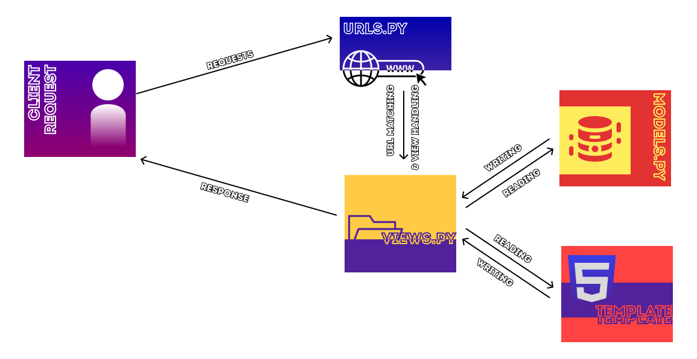
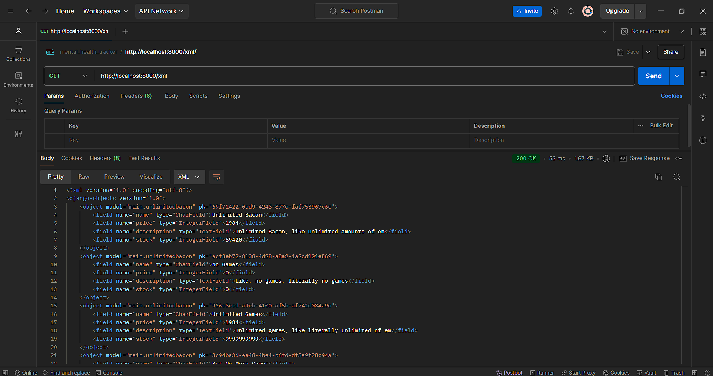
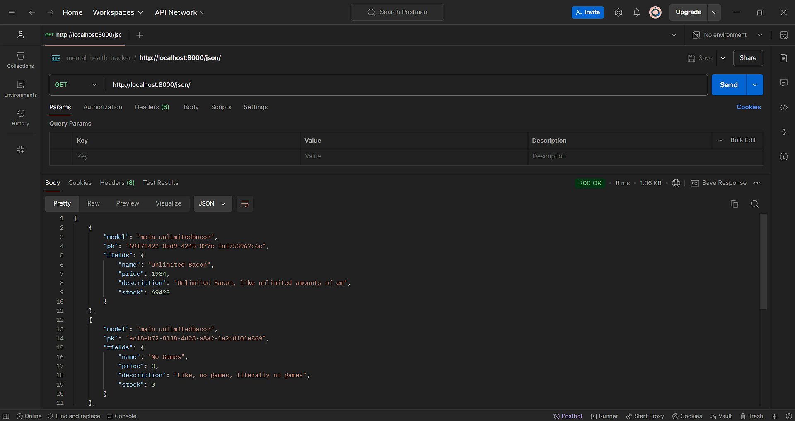
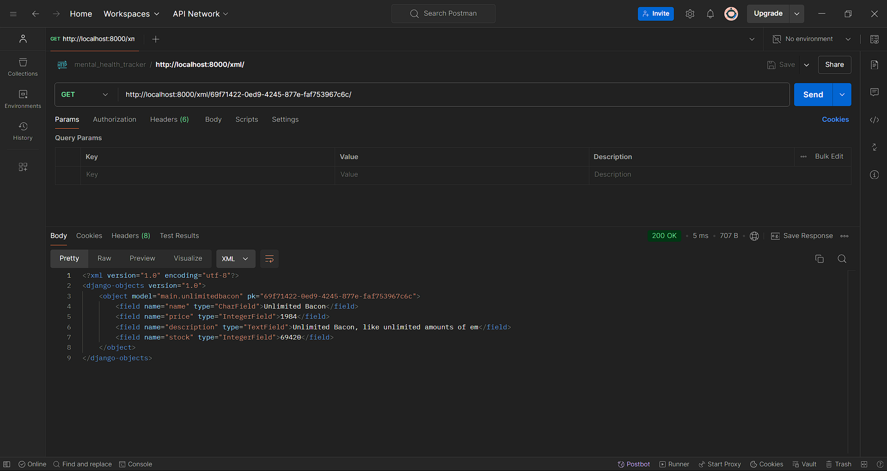
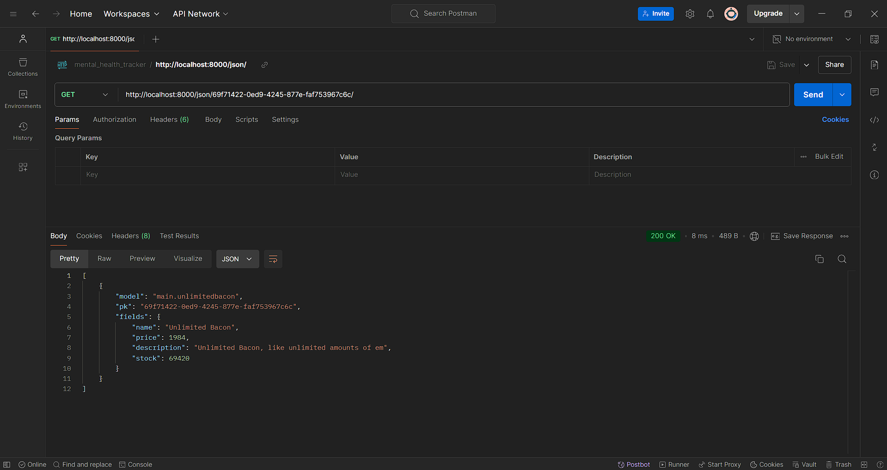
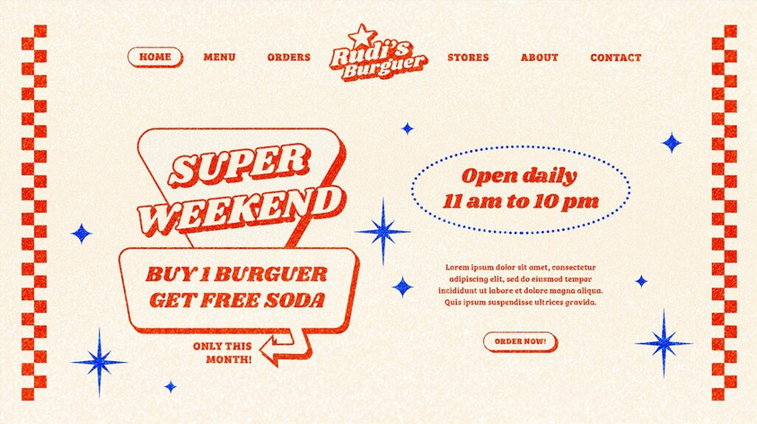

# Unlimited Bacon
PWS link: 

```
http://muhammad-ghaza31-unlimitedbacon.pbp.cs.ui.ac.id/
```

## Assignment 2 

### 1. Steps: 
1. Make a new local directory named ```unlimited_bacon```
2. Initialized as well configuring ```git``` in the repository
3. Create a new repository in GitHub with the same name
4. Connecting local repository with the GitHub repository by:
   - Setting a new branch named ```main``` using:

    ```bash
    git branch -M main
    ```
   - Connecting the local repository to GitHub using:

    ```bash
    git remote add origin https://github.com/GhazaFadhlilbaqi/unlimited_bacon.git 
    ```
5. In the local directory, set up a virtual environment by running:

    ```bash
    python -m venv env
    ```
   And activating it by:

    ```bash
    env\Scripts\activate
    ```
6. Set up requirements in the same local directory by:
   - Creating a new directory called ```requirements.txt``` with the contents being: 

    ```
    django
    gunicorn
    whitenoise
    psycopg2-binary
    requests
    urllib3
    ```
   - Running the command to enable the requirements

   ```bash
   pip install -r requirements.txt
   ```
7. Create a new Django project by running:
    ```bash
    django-admin startproject unlimited_bacon .
    ```
8. Add the following to ```ALLOWED_HOST``` to allow access to local host:
    
    ```
    ALLOWED_HOSTS = ["localhost", "127.0.0.1"]
    ```
9. Create the ```main``` app inside the main directory by:
    - Running the following command

    ```bash
    python manage.py startapp main
    ```
    - And adding ```main``` to the ```INSTALLED_APPS``` in ```settings.py```

    ```
    INSTALLED_APPS = [
    'main'
    ]
    ```
10. Create a new directory in ```main``` named ```templates``` with a ```html``` file named ```main.html``` with the contents:

    ```html
    <!DOCTYPE html>
    <html lang="en">
    <head>
        <meta charset="UTF-8">
        <meta name="viewport" content="width=device-width, initial-scale=1.0">
    <title>UnlimitedBacon</title>
    </head>
    <body>
        <h1>
            {{ app_name }}
        </h1>

        <p>
            {{ name }}
        </p>
        <p>
            {{ class }}
        </p>
    </body>
    </html>
    ```
11. Adding new models by modifying ```models.py``` by:
    - Adding the following to the file:

    ```python
    from django.db import models

    class UnlimitedBacon(models.Model):
    name = models.CharField(max_length=100)
    price = models.IntegerField()
    description = models.TextField()
    image = models.ImageField(upload_to='images/')
    stock = models.IntegerField()
    ```
    - Execute the two commands to migrate any changes made to the ```model.py``` file:

    ```bash
    python manage.py makemigrations
    python manage.py migrate
    ```
12. Integrating the ```views.py``` file with the ```main.html``` file:
    
    ```python
    from django.shortcuts import render

    def show_main(request):
        context = {
            'app_name': 'Unlimited Bacon',
            'name': 'Muhammad Ghaza Fadhlilbaqi',
            'class': 'KKI'
        }

        return render(request, 'main.html', context)
    ```
13. Route the ```main``` application to the ```urls.py``` file by:
    - Adding the following to ```urls.py``` in the ```main``` directory

    ```python
    from django.urls import path
    from main.views import show_main

    app_name = 'main'

    urlpatterns = [
        path('', show_main, name='show_main'),
    ]
    ```
    - Add a URL route in the ```urls.py``` file in the ```unlimited_bacon``` directory by:
    
    ```python
    from django.contrib import admin
    from django.urls import path, include

    urlpatterns = [
        path('admin/', admin.site.urls),
        path('', include('main.urls')),
    ]
    ```
14. Test the app by:
    - Running the application by running the command:
    
    ```bash
    python manage.py runserver
    ```
    - Then open 
    
    ```bash
    http://localhost:8000/
    ```

### 2. Diagram:

According to the diagram above, when a user makes a request, the ```urls.py``` file routes requests to views in the ```views.py``` file, which process the request and interact with ```models.py``` for data. The view then uses the ```main.html``` template to format the response, which is sent back to the user’s browser.

### 3. Use of ```git```
```Git``` is a very important software used in software development for several different reasons:
- Version control: ```git``` allows devs to track any changes made to the code and even revert back to previous versions 
- Collaboration: ```git``` allows multiple developers to work on the same project simultaneously using **branches**. Each developer can work on their own branch without affecting the main codebase. Git also supports **pull requests**, enabling team members to review and discuss changes before merging them into the main project.

### 4. Reason to use Django
Django is often chosen as a starting point for learning software development because it offers a comprehensive framework that simplifies the development process with several built-in features. Its thorough, beginner-friendly documentation and use of the Model-View-Template (MVT) pattern help beginners grasp essential web development concepts. Django also emphasizes security, has a strong community, and is used in many professional applications.

### 5. ORM
The Django model is called an **ORM** (Object-Relational Mapping) because it allows developers to interact with a database using Python classes instead of raw SQL. It maps Python objects to database tables, automatically handling the translation between the two.

## Assignment 3

### 1. Data Delivery Purpose
Data delivery is needed for various different purposes, with one of the biggest one is user experience. Data delivery ensures that users get timely and accurate information, which in turn, will improve their overall experience.

### 2. XML v JSON
In my opinion, I prefer the JSON formats for data. The reason JSON is more popular is because it uses a more straight forward key-value format, which leads it to be more human readable compared to the complicated tag-structured format used by XML.

### 3. Usage of ```is_valid()```
The ```is_valid()``` method in Django forms is essential for validating form data according to specific rules. For example, a "price" field would require inputs to be a numerical value, if the conditions are met, the data will be saved, and error messages will appear if conditions are not met. This method is essential because it ensures that only valid data is processed, helps provide clear feedback to users, and keeps the code organized by handling validation in a single place.

### 4. Purpose of the ```csfr_token```
The ```csrf_token``` is crucial for securing Django forms against Cross-Site Request Forgery (CSRF) attacks. This token helps verify that form submissions are coming from your site, not from a malicious third-party site trying to trick users. 
if this token is not implemented in a Django form, it could lead to a **CSFR attack**. In this type of attack, the attacker sends a link in the form of sms, email, or chat. In this way, the attacker tricks the user who is already authenticated on the website to perform various actions such as transfer of funds, change of email, and so on. Depending upon the nature of the attack the attacker may take full access to the account.

### 5. Steps:
1. Creating Base HTML template by:
   - Creating ```templates``` directory in the ```Root``` directory
   - Create ```base.html``` file with the contents:

   ```html
    
    <!DOCTYPE html>
    <html lang="en">
    <head>
        <meta charset="UTF-8" />
        <meta name="viewport" content="width=device-width, initial-scale=1.0" />
         
    </head>

    <body>
         
    </body>
    </html>
    ```

2. Make ```base.html``` as a template file by:
    - Opening ```settings.py``` and adjust the code:
    
    ```python
    TEMPLATES = [
        {
            'BACKEND': 'django.template.backends.django.DjangoTemplates',
            'DIRS': [BASE_DIR / 'templates'], # FILLING THE LIST WITH THIS CONTENT
            ...
        }
    ```

3. Changing IDs of models using UUID by:
    - Importing the ```uuid``` library

    ```python
    import uuid 
    from django.db import models
    ```
    - Adding the ```id``` model in ```models.py```:

    ```python
    # Create your models here.
    class UnlimitedBacon(models.Model):
        id = models.UUIDField(primary_key=True, default=uuid.uuid4, editable=False) 
        name = models.CharField(max_length=100)
        price = models.IntegerField()
        description = models.TextField()
        stock = models.IntegerField()    
    ```
    - Then migrate any changes in ```models.py``` as usual

4. Create ```forms.py``` in the ```main``` directory, and fill it in with the following contents:

    ```python
    from main.models import UnlimitedBacon
    from django import forms

    class UnlimitedBaconForm(forms.ModelForm):
        class Meta:
            model = UnlimitedBacon
            fields = '__all__'
    ```
5. Update the ```views.py``` file by:
    - Importing ```redirect``` from ```django.shortcuts```:

    ```python
    from django.shortcuts import render, redirect
    ```
    - Adding the ```create_bacon_entry``` function:

    ```python
    def create_bacon_entry(request):
        form = UnlimitedBaconForm()

        if request.method == 'POST':
            form = UnlimitedBaconForm(request.POST)
            if form.is_valid():
                form.save()
                return redirect('main:show_main')
            
        context = {'form': form}
        return render(request, 'create_bacon_entry.html', context)
    ```
    - Updating the ```show_main``` function:

    ```python
    def show_main(request):
        product_entries = UnlimitedBacon.objects.all() # ADDED product_entries VARIABLE

        context = {
            'app_name' : 'Unlimited Bacon',
            'name': 'Muhammad Ghaza Fadhlilbaqi',
            'class': 'PBP KKI',
            'product_entries': product_entries, # ADDED product_entries VARIABLE... again...
        }

        return render(request, "main.html", context)
    ```

6. Updating ```urls.py``` in the ```main``` directory by:
    - Importing the recently created ```create_bacon_entry``` function

    ```python
    from main.views import show_main, create_mood_entry
    ```
    - Adding a new URL path to ```url_patterns``` list

    ```python
    urlpatterns = [
        path('', show_main, name='show_main'),
        path('create_bacon_entry', create_bacon_entry, name='create_bacon_entry'),
    ]
    ```

7. Creating and modifying HTML files in ```main/templates``` by:
    - Creating a new HTML file named ```create_bacon_entry.html``` with the following contents:

    ```html
     
    
    <h1>Add New Product Entry</h1>

    <form method="POST">
    
    <table>
        {{ form.as_table }}
        <tr>
        <td></td>
        <td>
            <input type="submit" value="Add Product" />
        </td>
        </tr>
    </table>
    </form>

    
    ```
    - Modifying the ```main.html``` file into:

    ```html
    
    
    <h1>{{ app_name }}</h1>

    <h5>Name:</h5>
    <p>{{ name }}</p>

    <h5>Class:</h5>
    <p>{{ class }}</p>


    
    <p>There are no products available in the shop.</p>
    
    <table>
    <tr>
        <th>Product Name</th>
        <th>Price</th>
        <th>Description</th>
        <th>Stock</th>
    </tr>

    
    <tr>
        <td>{{product_entry.name}}</td>
        <td>{{product_entry.price}}</td>
        <td>{{product_entry.description}}</td>
        <td>{{product_entry.stock }}</td>
    </tr>
    
    </table>
    

    <br />

    <a href="">
    <button>Add Product</button>
    </a>

    
    ```

8. Creating Functions for XML, JSON, XML by ID and JSON by ID:
    - the XML function

    ```python
    def show_xml(request):
        data = UnlimitedBacon.objects.all()
        return HttpResponse(serializers.serialize('xml', data), content_type='application/xml')
    ```
    
    - the JSON function

    ```python
    def show_json(request):
        data = UnlimitedBacon.objects.all()
        return HttpResponse(serializers.serialize('json', data), content_type='application/json')
    ```

    - the XML by ID function

    ```python
    def show_xml_by_id(request, id):
        data = UnlimitedBacon.objects.filter(pk=id)
        return HttpResponse(serializers.serialize('xml', data), content_type='application/xml')
    ```

    - the JSON by ID function

    ```python
    def show_json_by_id(request, id):
        data = UnlimitedBacon.objects.filter(pk=id)
        return HttpResponse(serializers.serialize('json', data), content_type='application/json')
    ```

9. Routing the 4 new functions the ```urls.py``` file in the ```main``` directory

    ```python
    urlpatterns = [
        ...
        path('xml/', show_xml, name='show_xml'),
        path('json/', show_json, name='show_json'),
        path('xml/<str:id>/', show_xml_by_id, name='show_xml_by_id'),
        path('json/<str:id>/', show_json_by_id, name='show_json_by_id'),
    ]
    ```

10. Last but not least, testing the site in the localhost with

    ```bash
    python manage.py runserver
    ```
o(*￣▽￣*)o DONE!!!

### 6. Postman Screenshots:
1. **XML**


2. **JSON**


3. **XML by ID**


4. **JSON by ID**


## Assignment 4

### 1. ```HttpResponseRedirect()``` Vs ```redirect()```
Although both functions purpose are the same (redirecting users to a different url), they function quite differently
- ```HttpResponseRedirect()```
    Only accepts a full direct URL for redirection. Example:

    ```python
    response = HttpResponseRedirect(reverse('main:show_main'))
    # the reverse function returns the url of it's parameter
    ```
- ```redirect()```
    A more flexible redirection function which accepts direct urls, view names,  or even model instances. Example:

    ```python
    return redirect('main:show_main')
    ```

### 2. ```MoodEntry``` link with ```User```
The ```MoodEntry``` model can be linked to the built-in ```User``` model through a foreign key relationship. This relationship allows each mood entry to be associated with a specific user, enabling personalized data management.

### 3. Authentication vs Authorization
**Authentication** refers to the process of confirming a user’s identity. In Django, this involves verifying whether the user attempting to access the application is actually who they claim to be. 
**Authorization** deals with what a user is permitted to do once they have been authenticated. This process includes figuring out the rights and permissions assigned to each user.

### 4.  Use of Cookies
- Django remembers logged-in users primarily through the use of **sessions** and **cookies**.

- Other than that, cookies serve other various purposes, such as tracking user behavior for personalized experiences, remembering user   preferences like language and themes, remembering shopping carts contents on e-commerce sites, and even collecting analytics data on user engagement.

- However, not all cookies are safe to use. Secure cookies can only be transmitted over HTTPS, HttpOnly cookies are inaccessible via JavaScript to mitigate XSS attacks, and SameSite cookies help prevent CSRF by restricting cross-origin requests. Additionally, third-party cookies may pose privacy risks as they track users across different sites. Therefore, while cookies enhance user experience, it’s crucial to implement them with security best practices to protect user data and privacy.

### 5. Steps:
1. Implement the **Registration** feature by:
    - Importing ```UserCreationForm``` and ```messages``` to ```views.py```:

    ```python
    from django.contrib.auth.forms import UserCreationForm
    from django.contrib import messages
    ```

    - Adding a ```register``` function in the same file:

    ```python
    def register(request):
        form = UserCreationForm()

        if request.method == 'POST':
            form = UserCreationForm(request.POST)
            if form.is_valid():
                form.save()
                messages.success(request, 'Your account has been successfully created!')
                return redirect('main:login')
        context = {'form': form}   
        return render(request, 'register.html', context)
    ```

    - Create the HTML template for registration in ```main/templates``` called ```register.html```:

    ```html
     
    <title>Register</title>
     

    <div class="login">
    <h1>Register</h1>

    <form method="POST">
        
        <table>
        {{ form.as_table }}
        <tr>
            <td></td>
            <td><input type="submit" name="submit" value="Register" /></td>
        </tr>
        </table>
    </form>

    
    <ul>
        
        <li>{{ message }}</li>
        
    </ul>
    
    </div>

    
    ```

    - Route ```registration``` in ```urls.py``` in the ```main``` directory:

    ```python
    from main.views import register
    ...
    urlpatterns = [
    ...
    path('register/', register, name='register'),
    ]
    ```

2. Implementing the **Login** feature by:
    - Importing ```AuthenticationForm```, ```authenticate```, and ```login``` in ```views.py```:

    ```python
    from django.contrib.auth.forms import UserCreationForm, AuthenticationForm
    from django.contrib.auth import authenticate, login
    ```

    - Add the ```login_user``` function: 

    ```python
    def login_user(request):
    if request.method == 'POST':
        form = AuthenticationForm(data=request.POST)

        if form.is_valid():
                user = form.get_user()
                login(request, user)
                response  = HttpResponseRedirect(reverse('main:show_main'))
                response.set_cookie('last_login', str(datetime.datetime.now()))
                return response

    else:
        form = AuthenticationForm(request)
    context = {'form': form}
    return render(request, 'login.html', context)
    ```

    - Create the HTML file for the login page in ```main/templates``` with the file name ```login.html```

    ```html
     
    <title>Register</title>
     

    <div class="login">
    <h1>Register</h1>

    <form method="POST">
        
        <table>
        {{ form.as_table }}
        <tr>
            <td></td>
            <td><input type="submit" name="submit" value="Register" /></td>
        </tr>
        </table>
    </form>

    
    <ul>
        
        <li>{{ message }}</li>
        
    </ul>
    
    </div>

    
    ```

    - Route the login function in ```urls.py``` at the ```main``` directory

    ```python
    from main.views import login_user
    ...
    urlpatterns = [
    ...
    path('login/', login_user, name='login'),
    ]
    ```

3. Implementing the **Logout** feature by:

    - Importing ```logout``` to ```views.py```:

    ```python
    from django.contrib.auth import logout
    ```

    - Adding the ```logout_user``` function in the same file:

    ```python
    def logout_user(request):
        logout(request)
        response = HttpResponseRedirect(reverse('main:login'))
        response.delete_cookie('last_login')
        return response
    ```

    - Adding a ```logout``` button in the ```main.html``` file in ```main/templates```:
    
    ```html
    <a href="">
        <button>Logout</button>
    </a>
    ```

4. Restricting access to main page by:
    - Import ```login_required``` to ```views.py```

    ```python
    from django.contrib.auth.decorators import login_required
    ```

    - Add the ```login_required``` decorator above the ```show_main``` function in the same file:

    ```python
    ...
    @login_required(login_url='/login')
    def show_main(request):
    ...
    ```

5. Connecting ```UnlimitedBacon``` and ```User``` by:
    - Importing ```User``` to ```models.py:

    ```python
    ...
    from django.contrib.auth.models import User
    ...
    ```
    - Adding ```user``` variable in ```UnlimitedBacon``` model:

    ```python
    class UnlimitedBacon(models.Model):
        user = models.ForeignKey(User, on_delete=models.CASCADE)
    ...
    ```
    - Modify the ```create_bacon_entry``` function in ```views.py```:

    ```python
    def create_bacon_entry(request):
        form = UnlimitedBaconForm(request.POST or None)

        if form.is_valid() and request.method == "POST":
            product_entry = form.save(commit=False)
            product_entry.user = request.user
            product_entry.save()
            return redirect('main:show_main')
        
        context = {'form': form}
        return render(request, 'create_bacon_entry.html', context)
    ```
    - Modify the ```product_entries``` variable in ```views.py```:

    ```python
    def show_main(request):
        product_entries = UnlimitedBacon.objects.filter(user=request.user)
    ```
    - Run model migrations as usual
    - Modify the ```settings.py``` file by importing ```os``` and changing the ```DEBUG``` variable to:
    
    ```python
    import os
    ...
    PRODUCTION = os.getenv('PRODUCTION', False)
    DEBUG = not PRODUCTION
    ...
    ```

6. Implementing Cookies by:
    - Importing ```datetime```, ```HttpResponseRedirect```, and ```reverse``` to ```views.py```

    ```python
    import datetime
    from django.http import HttpResponseRedirect
    from django.urls import reverse
    ```
    - Modify the ```login_user``` function with:

    ```python
    if form.is_valid():
        user = form.get_user()
        login(request, user)
        response = HttpResponseRedirect(reverse("main:show_main"))
        response.set_cookie('last_login', str(datetime.datetime.now()))
        return response
    ```
    - Add the ```last_login``` variable in the ```show_main``` function in the same file

    ```python
    context = {
        'app_name' : 'Unlimited Bacon',
        'name': request.user.username,
        'class': 'PBP KKI',
        'product_entries': product_entries,
        'last_login': request.COOKIES['last_login'],
    }
    ```
    - Modifying the ```logout_user``` function in the same file

    ```python
    def logout_user(request):
        logout(request)
        response = HttpResponseRedirect(reverse('main:login'))
        response.delete_cookie('last_login')
        return response
    ```
    - Add the display for the ```last login``` data in the ```main.html``` file

    ```html
    ...
    <h5>Last login session: {{ last_login }}</h5>
    ...
    ```

7. And of course, testing the site in the [localhost](http://localhost:8000/) with:

    ```bash
    python manage.py runserver
    ```
DONE!!! d==(￣▽￣*)b

## Assignment 5

### 1. CSS Priority Order:
From the highest to the lowest priority:
**Inline styles** have the highest priority, 
**IDs** have the second highest priority (e.g., #example). 
**Classes, Attributes, and Pseudo-Classes** (e.g., .example, [type="text"], :hover), have moderate specificity. 
**Element selectors** (e.g., div, p) and pseudo-elements (e.g., ::before, ::after) have lower priority. 
**The universal selector** (*) has the lowest specificity. 
If selectors have equal specificity, the one that appears last in the stylesheet prevails. 
Additionally, styles marked with ```!important``` override all other rules regardless of specificity.

### 2. Importance of Responsive Design:
Responsive design is crucial in web application development because it ensures that applications function well across a variety of devices and screen sizes, providing a consistent user experience. With the increasing use of smartphones and tablets, responsive design allows websites to adapt their layout and content, improving accessibility and usability.
Nowadays, many modern web apps have been designed with responsiveness in mind. Examples are but not limited to Instagram, Twitter, Airbnb, and many more
A broad example for unresponsive designed websites would be simple HTML websites designed in the early 2000s, where the layout is fixed with a specific width (e.g., 800 pixels).

### 3. Margin vs Border vs Padding:
The difference between Margin, Padding, and Border lies in their placement and purpose. 
**Margin** is the space outside an element's border, controlling the distance between that element and others around it, without affecting the element's appearance. 
**Padding** is the space inside the element's border, creating distance between the content and the border, and can have a background color, influencing the element's look. 
**Border** is the line that surrounds the padding, defining the element's boundary, and can also have a color and style, further shaping the element's visual presentation. 

### 4. Flexboxes & Grid Layouts:
**Flexboxes** are designed for one-dimensional layouts, allowing items within a container to be aligned and distributed efficiently along a single axis (either horizontally or vertically). It is particularly useful for aligning elements, managing space between items, and ensuring they resize proportionally. Common uses include navigation menus, card layouts, and centering elements.

**Grid Layouts**, on the other hand, are for two-dimensional layouts, enabling designers to create complex grid structures with rows and columns. It allows for precise control over placement and size of elements within the grid. Grid is ideal for layouts that require both horizontal and vertical alignment, such as entire page layouts, dashboards, and image galleries.

### 5. Steps:
1. Implementing the **Edit** feature by:
    - Adding new imports as well as creating a new Function named ```edit_product``` in ```views.py```:

    ```python
    ...
    from django.shortcuts import .., reverse
    from django.http import .., HttpResponseRedirect
    ...

    def edit_product(request, id):
        # Get mood entry based on id
        product = UnlimitedBacon.objects.get(pk = id)

        # Set mood entry as an instance of the form
        form = UnlimitedBaconForm(request.POST or None, instance=product)

        if form.is_valid() and request.method == "POST":
            # Save form and return to home page
            form.save()
            return HttpResponseRedirect(reverse('main:show_main'))

        context = {'form': form}
        return render(request, "edit_product.html", context)
    ```

    - Creating the ```HTML``` template called ```edit_product.html``` in the ```main/template``` directory:

    ```html
    

    

    

    <h1>Edit Product</h1>

    <form method="POST">
        
        <table>
            {{ form.as_table }}
            <tr>
                <td></td>
                <td>
                    <input type="submit" value="Edit Product"/>
                </td>
            </tr>
        </table>
    </form>

    
    ```

    - Importing the ```edit_product``` function to ```urls.py``` in the ```main``` directory:

    ```python
    ...
    from main.views import edit_product
    ...
    urlpatterns = [
    ...
        path('edit-product/<uuid:id>', edit_product, name='edit_mood'),
    ]
    ...
    ```

    - Edit ```main.html``` to add an edit button:

    ```html
    ...
    <tr>
        ...
        <td>
            <a href="">
                <button>
                    Edit
                </button>
            </a>
        </td>
    </tr>
    ...
    ```

2. Adding the **Delete** feature by:
    - Creating a new function named ```delete_product``` in ```views.py```

    ```python
    def delete_product(request, id):
        # Get mood based on id
        mood = UnlimitedBacon.objects.get(pk = id)
        # Delete mood
        mood.delete()
        # Return to home page
        return HttpResponseRedirect(reverse('main:show_main'))
    ```
    - Importing the ```delete_product``` function to ```urls.py``` in the ```main``` directory:

    ```python
    ...
    from main.views import edit_product, delete_product
    ...
    urlpatterns = [
        ...
        path('edit_product/<uuid:id>', edit_product, name='edit_product'),
        path('delete/<uuid:id>', delete_product, name='delete_product'),
    ]
    ```

    - Edit ```main.html``` again to add a delete button:

    ```html
    ...
    <tr>
        ...
        <td>
            <a href="">
                <button>
                    Edit
                </button>
            </a>
        </td>
        <td>
            <a href="">
                <button>
                    Delete
                </button>
            </a>
        </td>
    </tr>
    ...
    ```

3. Designing the Web Pages:
    - Theme chosen: Retro American Diner Design (Reference Image)
    

    - Installing **Tailwind** to ```base.html``` in ```templates``` directory:

    ```html
    
    <!DOCTYPE html>
    <html lang="en">
    <head>
        <meta charset="UTF-8" />
        <meta name="viewport" content="width=device-width, initial-scale=1.0" />
         
        <script src="https://cdn.tailwindcss.com"></script>
        <link rel="stylesheet" href=""/>
    </head>
    <body>
         
    </body>
    </html>
    ```

4. Designing the **Login Page**:

    ```html
    
    
    
    <title>Login</title>
    

    
    <!-- Full-width background color -->
    <div class="bg-[#F5EEDC] min-h-screen flex items-center justify-center px-4 sm:px-6 lg:px-8">
    <!-- Login Wrapper -->
    <div class="absolute top-0 left-0 right-0 h-1/6 bg-[conic-gradient(#F5EEDC_25%,#dc143c_25%_50%,#F5EEDC_50%_75%,#dc143c_75%)] bg-[size:117px_119px]">
    </div>
    
    <div class="max-w-md w-full bg-[#dc143c] p-10 rounded-lg shadow-2xl">
        <h2 class="text-center text-4xl font-extrabold text-[#F5EEDC] mb-6">
        LOGIN
        </h2>
        <form class="mt-8 space-y-6" method="POST" action="">
        
        <input type="hidden" name="remember" value="true">
        <div class="rounded-md shadow-sm -space-y-px">
            <div>
            <label for="username" class="sr-only">Username</label>
            <input id="username" name="username" type="text" required class="appearance-none rounded-none relative block w-full px-3 py-2 border border-gray-300 placeholder-gray-500 text-gray-900 rounded-t-md focus:outline-none focus:ring-rose-500 focus:border-rose-500 focus:z-10 sm:text-sm" placeholder="Username">
            </div>
            <div>
            <label for="password" class="sr-only">Password</label>
            <input id="password" name="password" type="password" required class="appearance-none rounded-none relative block w-full px-3 py-2 border border-gray-300 placeholder-gray-500 text-gray-900 rounded-b-md focus:outline-none focus:ring-rose-500 focus:border-rose-500 focus:z-10 sm:text-sm" placeholder="Password">
            </div>
        </div>

        <div>
            <button type="submit"
            class="group relative w-full flex justify-center py-3 px-4 border border-transparent text-sm font-medium rounded-md text-[#dc143c] bg-[#F5EEDC] hover:bg-[#DED7C7] focus:outline-none focus:ring-2 focus:ring-offset-2 focus:ring-[#dc143c] transition duration-200 ease-in-out">
            Sign in
            </button>
        </div>
        </form>

        
        <div class="mt-4">
        
        
        <div class="bg-green-100 border border-green-400 text-green-700 px-4 py-3 rounded relative" role="alert">
            <span class="block sm:inline">{{ message }}</span>
        </div>
        
        <div class="bg-red-100 border border-red-400 text-red-700 px-4 py-3 rounded relative" role="alert">
            <span class="block sm:inline">{{ message }}</span>
        </div>
        
        <div class="bg-blue-100 border border-blue-400 text-blue-700 px-4 py-3 rounded relative" role="alert">
            <span class="block sm:inline">{{ message }}</span>
        </div>
        
        
        </div>
        

        <div class="text-center mt-6">
        <p class="text-sm text-white">
            Don't have an account yet?
            <a href="" class="font-medium text-cyan-300 hover:text-cyan-400">
            Register Now
            </a>
        </p>
        </div>
    </div>

    <div class="absolute bottom-0 left-0 right-0 h-1/6 bg-[conic-gradient(#F5EEDC_25%,#dc143c_25%_50%,#F5EEDC_50%_75%,#dc143c_75%)] bg-[size:117px_119px]">
    </div>  
    </div>

    
    ```

5. Designing the **Registration Page**:

    ```html
    

    
    <title>Register</title>
    

    
    <!-- Checkered Pattern -->
    <div class="min-h-screen flex items-center justify-center w-screen bg-[#F5EEDC] border-[#dc143c] border-8 py-12 px-4 sm:px-6 lg:px-8">
    <div class="max-w-md mx-auto w-full bg-[#dc143c] p-8 rounded-lg shadow-lg space-y-8 form-style">
        <h2 class="mt-6 text-center text-3xl font-extrabold text-[#F5EEDC]">
            REGISTER
        </h2>
        <form class="mt-8 space-y-6" method="POST">
        
        <input type="hidden" name="remember" value="true">
        <div class="rounded-md shadow-sm -space-y-px">
            
            <div class="mt-4">
                <label for="{{ field.id_for_label }}" class="mb-2 font-semibold text-white">
                {{ field.label }}
                </label>
                <div class="relative">
                {{ field }}
                <div class="absolute inset-y-0 right-0 pr-3 flex items-center pointer-events-none">
                    
                    <svg class="h-5 w-5 text-red-500" fill="currentColor" viewBox="0 0 20 20">
                        <path fill-rule="evenodd" d="M18 10a8 8 0 11-16 0 8 8 0 0116 0zm-7 4a1 1 0 11-2 0 1 1 0 012 0zm-1-9a1 1 0 00-1 1v4a1 1 0 102 0V6a1 1 0 00-1-1z" clip-rule="evenodd" />
                    </svg>
                    
                </div>
                </div>
                
                
                    <p class="mt-1 text-sm text-red-600">{{ error }}</p>
                
                
            </div>
            
        </div>

        <div>
            <button type="submit" class="group relative w-full flex justify-center py-2 px-4 border border-transparent text-sm font-medium rounded-md text-[#dc143c] bg-[#F5EEDC] hover:bg-[#DED7C7] focus:outline-none focus:ring-2 focus:ring-offset-2 focus:ring-rose-500">
            Register
            </button>
        </div>
        </form>

        
        <div class="mt-4">
        
        <div class="bg-red-100 border border-red-400 text-red-700 px-4 py-3 rounded relative" role="alert">
            <span class="block sm:inline">{{ message }}</span>
        </div>
        
        </div>
        

        <div class="text-center mt-4">
        <p class="text-sm text-black">
            Already have an account?
            <a href="" class="font-medium text-cyan-300 hover:text-cyan-400">
            Login here
            </a>
        </p>
        </div>
    </div>
    </div>
    

    <style>
    @media (min-width: 640px) { /* Small devices (tablets) */
        .bg-checkered {
        background-size: 40px 40px;
        height: 200px; /* Adjust height as needed */
        }
    }

    @media (min-width: 768px) { /* Medium devices (desktops) */
        .bg-checkered {
        height: 150px; /* Adjust height as needed */
        }
    }

    @media (min-width: 1024px) { /* Large devices (larger desktops) */
        .bg-checkered {
        height: 100px; /* Adjust height as needed */
        }
    }

    @media (max-width: 639px) { /* Extra small devices (phones) */
        .bg-checkered {
        height: 250px; /* Adjust height as needed */
        }
    }
    </style>
    ```

6. Designing the **Add Products Page**:

    ```html
    
    
    
    <title>Create Product</title>
    

    
    
    <div class="min-h-screen flex flex-col items-center justify-center w-screen bg-[#F5EEDC] relative">
        <!-- Main content area -->
        <div class="container mx-auto px-4 py-8 mt-16 max-w-xl">
            <h1 class="text-3xl font-bold text-center mb-8 text-Gray">Create Products</h1>

            <div class="bg-[#FFFFFF] rounded-lg p-6 form-style">
            <form method="POST" class="space-y-6">
                
                
                    <div class="flex flex-col">
                        <label for="{{ field.id_for_label }}" class="mb-2 font-semibold text-gray-700">
                            {{ field.label }}
                        </label>
                        <div class="w-full">
                            {{ field }}
                        </div>
                        
                            <p class="mt-1 text-sm text-gray-500">{{ field.help_text }}</p>
                        
                        
                            <p class="mt-1 text-sm text-red-600">{{ error }}</p>
                        
                    </div>
                
                <div class="flex justify-center mt-6">
                    <button type="submit" class="bg-[#dc143c] text-white font-semibold px-6 py-3 rounded-lg hover:bg-[#B51233] transition duration-300 ease-in-out w-full">
                        Create Product
                    </button>
                </div>
            </form>
            </div>
        </div>
        <!-- Side Checkered Patters -->
        <div class="absolute top-0 right-0 bottom-0 w-1/6 bg-[conic-gradient(#F5EEDC_25%,#dc143c_25%_50%,#F5EEDC_50%_75%,#dc143c_75%)] bg-[size:96px_96px]"></div>
        <div class="absolute top-0 left-0 bottom-0 w-1/6 bg-[conic-gradient(#F5EEDC_25%,#dc143c_25%_50%,#F5EEDC_50%_75%,#dc143c_75%)] bg-[size:96px_96px]"></div>

    </div>
    
    ```

7. Designing the **Edit Products Page**

    ```html
    
    
    
    <title>Edit Product</title>
    

    
    
    <div class="min-h-screen flex flex-col items-center justify-center w-screen bg-[#F5EEDC] relative">
        <!-- Main content area -->
        <div class="container mx-auto px-4 py-8 mt-16 max-w-xl">
            <h1 class="text-3xl font-bold text-center mb-8 text-Gray">Edit Products</h1>

            <div class="bg-[#FFFFFF] rounded-lg p-6 form-style">
            <form method="POST" class="space-y-6">
                
                
                    <div class="flex flex-col">
                        <label for="{{ field.id_for_label }}" class="mb-2 font-semibold text-gray-700">
                            {{ field.label }}
                        </label>
                        <div class="w-full">
                            {{ field }}
                        </div>
                        
                            <p class="mt-1 text-sm text-gray-500">{{ field.help_text }}</p>
                        
                        
                            <p class="mt-1 text-sm text-red-600">{{ error }}</p>
                        
                    </div>
                
                <div class="flex justify-center mt-6">
                    <button type="submit" class="bg-[#dc143c] text-white font-semibold px-6 py-3 rounded-lg hover:bg-[#B51233] transition duration-300 ease-in-out w-full">
                        Edit Product
                    </button>
                </div>
            </form>
            </div>
        </div>

        <!-- Side Checkered Patters -->
        <div class="absolute top-0 right-0 bottom-0 w-1/6 bg-[conic-gradient(#F5EEDC_25%,#dc143c_25%_50%,#F5EEDC_50%_75%,#dc143c_75%)] bg-[size:96px_96px]"></div>
        <div class="absolute top-0 left-0 bottom-0 w-1/6 bg-[conic-gradient(#F5EEDC_25%,#dc143c_25%_50%,#F5EEDC_50%_75%,#dc143c_75%)] bg-[size:96px_96px]"></div>
    </div>
    
    ```

8. Designing the **Main Page**:
    - Designing the **User Info Card** by creating a new html file called ```card_info.html``` in ```main/templates```:

    ```html
    <div class="bg-[#F5EEDC] overflow-hidden rounded-xl border-8 border-[#dc143c]"\
        style="box-shadow: 8px 8px 0px #dc143c;">
        <div class="p-4">
            <h5 class="text-lg font-semibold text-[#dc143c]">{{ title }}</h5>
            <p class="text-[#dc143c]">{{ value }}</p>
        </div>
    </div>
    ```
    - Designing the **Product Card** by creating a new html file called ```card_product.html``` in ```main/templates```:

    ```html
    <div class="relative break-inside-avoid">
    <div class="relative top-5 bg-[#f5eedc] shadow-md rounded-lg mb-6 break-inside-avoid flex flex-col border-8 border-[#dc143c] transform rotate-1 hover:rotate-0 transition-transform duration-300"
        style="box-shadow: 8px 8px 0px #dc143c;">
        
        <!-- Product Title -->
        <div class="bg-[#dc143c] text-white p-4 border-2 border-[#dc143c] h-40 flex items-center justify-center">
        <h2 class="text-center font-bold text-3xl mb-2">{{ product_entry.name }}</h2>
        </div>

        <!-- Product Details -->
        <div class="p-4">
        <h3 class="font-bold text-2xl text-[#dc143c] mb-1">{{ product_entry.name }}</h3>
        <p class="text-[#dc143c] text-lg mb-2">${{ product_entry.price }}.99</p>
        <p class="text-sm text-[#dc143c]">{{ product_entry.description|truncatewords:15 }}</p>
        </div>

        <!-- Stock Information -->
        <div class="text-sm p-4">
        Stock: {{ product_entry.stock }}
        </div>
    </div>

    <!-- Edit and Delete Buttons -->
    <div class="absolute top-0 -right-4 flex space-x-1">
        <!-- Edit Button -->
        <a href="" class="bg-[#f5eedc] hover:bg-[#E7CAB9] text-[#dc143c] rounded-full p-2 transition duration-300 shadow-md">
        <svg xmlns="http://www.w3.org/2000/svg" class="h-9 w-9" viewBox="0 0 20 20" fill="currentColor">
            <path d="M13.586 3.586a2 2 0 112.828 2.828l-.793.793-2.828-2.828.793-.793zM11.379 5.793L3 14.172V17h2.828l8.38-8.379-2.83-2.828z" />
        </svg>
        </a>

        <!-- Delete Button -->
        <a href="" class="bg-[#f5eedc] hover:bg-red-600 text-[#dc143c] hover:text-[#f5eedc] rounded-full p-2 transition duration-300 shadow-md">
        <svg xmlns="http://www.w3.org/2000/svg" class="h-9 w-9" viewBox="0 0 20 20" fill="currentColor">
            <path fill-rule="evenodd" d="M9 2a1 1 0 00-.894.553L7.382 4H4a1 1 0 000 2v10a2 2 0 002 2h8a2 2 0 002-2V6a1 1 0 100-2h-3.382l-.724-1.447A1 1 0 0011 2H9zM7 8a1 1 0 012 0v6a1 1 0 11-2 0V8zm5-1a1 1 0 00-1 1v6a1 1 0 102 0V8a1 1 0 00-1-1z" clip-rule="evenodd" />
        </svg>
        </a>
    </div>
    </div>
    ```
    - Putting them together in ```main.html```:

    ```html
    
    

    
    <title>Unlimited Bacon</title>
    

    
    
    <div class="overflow-x-hidden px-4 md:px-8 pb-8 pt-24 min-h-screen bg-[#F5EEDC] flex flex-col">
    <div class="p-2 mb-6 relative">
        <div class="relative grid grid-cols-1 z-30 md:grid-cols-2 gap-8">
        
        
        </div>
    </div>

    <div class="px-3 mb-4">
        <div class="flex rounded-md items-center bg-[#dc143c] py-2 px-4 w-fit">
        <h1 class="text-white text-center">Last Login: {{last_login}}</h1>
        </div>
    </div>

    <div class="flex justify-end mb-6">
        <a href="" class="bg-[#dc143c] hover:bg-[#C1144B] text-white font-bold py-2 px-4 rounded-lg transition duration-300 ease-in-out transform hover:-translate-y-1 hover:scale-105">
            Add New Product
        </a>
    </div>

    
    <div class="flex flex-col items-center justify-center min-h-[24rem] p-6">
        
        <p class="text-center text-gray-600 mt-4">There are no products available.</p>
    </div>
    
    <div class="grid grid-cols-1 sm:grid-cols-2 lg:grid-cols-3 gap-6 w-full">
        
            
        
    </div>
    
    </div>
    
    ```

9. Creating a responsive **Navbar**:
    - Create a new html file called ```navbar.html``` in the ```templates``` directory:

    ```html
    <nav class="bg-[#dc143c] shadow-lg fixed top-0 left-0 z-40 w-screen">
    <div class="max-w-7xl mx-auto px-4 sm:px-6 lg:px-8">
        <div class="flex items-center justify-between h-16">
            <div class="flex items-center">
                <h1 class="text-2xl font-bold text-center text-slate-100">Unlimited Bacon</h1>
            </div>
            <div class="hidden md:flex items-center space-x-6">
                
                    <span class="text-white mr-4">Welcome, {{ user.username }}</span>
                    <a href="" class="text-center bg-slate-100 hover:bg-slate-300 text-[#dc143c] font-bold py-2 px-4 rounded transition duration-300">
                        Logout
                    </a>
                
                    <a href="" class="text-center bg-blue-500 hover:bg-blue-600 text-white font-bold py-2 px-4 rounded transition duration-300 mr-2">
                        Login
                    </a>
                    <a href="" class="text-center bg-green-500 hover:bg-green-600 text-white font-bold py-2 px-4 rounded transition duration-300">
                        Register
                    </a>
                
            </div>
            <div class="md:hidden flex items-center">
                <button class="mobile-menu-button focus:outline-none">
                    <svg class="w-6 h-6 text-white" fill="none" stroke-linecap="round" stroke-linejoin="round" stroke-width="2" viewBox="0 0 24 24" stroke="currentColor">
                        <path d="M4 6h16M4 12h16M4 18h16"></path>
                    </svg>
                </button>
            </div>
        </div>
    </div>

    <!-- Mobile Menu (Hidden by default) -->
    <div class="mobile-menu hidden md:hidden px-4 w-full bg-[#dc143c]">
        
            <span class="block text-gray-300 text-center px-3 py-2 rounded-md text-sm font-medium">Welcome, {{ user.username }}!</span>
            <a href="" class="block text-center bg-red-500 hover:bg-red-600 text-white font-bold py-2 px-4 rounded-md transition duration-300">
                Logout
            </a>
        
            <a href="" class="block text-center bg-blue-500 hover:bg-blue-600 text-white font-bold py-2 px-4 rounded-md transition duration-300 mb-2">
                Login
            </a>
            <a href="" class="block text-center bg-green-500 hover:bg-green-600 text-white font-bold py-2 px-4 rounded-md transition duration-300">
                Register
            </a>
        
    </div>

    <script>
        const btn = document.querySelector("button.mobile-menu-button");
        const menu = document.querySelector(".mobile-menu");

        btn.addEventListener("click", () => {
            menu.classList.toggle("hidden");
        });
    </script>
    </nav>
    ```

DONE!!!人(￣︶￣〃)